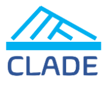

# Cloud Lakehouse Architecture as Digitalization Enabler (CLADE) 

  

This project, “Cloud Lakehouse Architecture as Digitalization Enabler (CLADE)”, addresses the challenges of current Data Lakehouse architectures. This new architecture proposes the combination of the data lake and data warehouse with advanced business analytics, open direct-access data formats, out-of-the box machine learning support and it provides outstanding performance. The main cloud data platforms used in this project are Snowflake and Databricks, which are actually trying to become a complete data lakehouse. All these concepts and platforms are explained in the CLADE documentation available via MKDocs in this repository.
